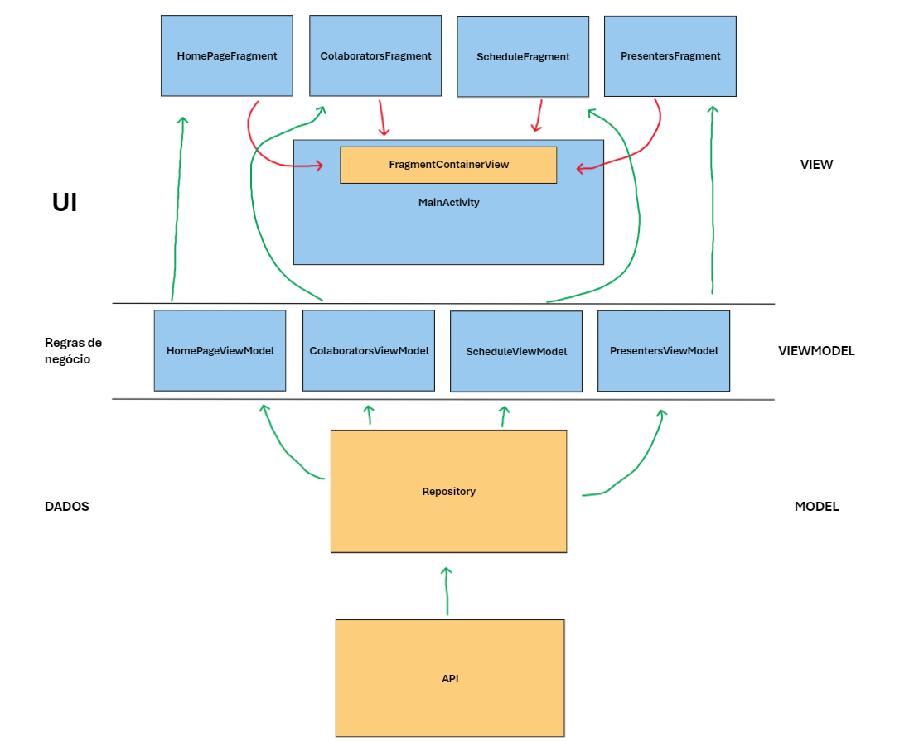

# MeetApp | App de acompanhamento de evento
 

Desenvolvido em Kotlin para Android de forma nativa, o MeetApp conta algumas das formas modernas de se construir apps nativamente mais usadas, como:

✅ Material Design e Componentes  
✅ Requisições Web via API  
✅ MVVM  
✅ Repository  
✅ ViewPager  
✅ RecyclerViews

## Dependências do projeto: 

⩥ **GSON** | Tratamento de dados Json  
⩥ **RETROFIT** | Biblioteca de requisições Web  
⩥ **COIL** | Requisição, renderização e tratamento de imagens da web
  
  
## ARQUITETURA MVVM

## Pacotes de arquivos de recursos -> `app/src/main/res`

### `.drawable` -> Imagens, shapes e ícones
### `.font` -> fontes usadas
### `.layout` -> arquivos de layout em xml dos fragments e activities
### `.menu` -> arquivos de conteúdo de menus, como barras de navegação
### `.mipmap-` * -> ícone do app
### `.values` -> Temas do app, arquivos de estilo, cores, strings de layout

## PACOTES - > app/src/main/java/ com.example.meetapp

### `.applications` -> pacote de aplicações, não implementado
### `.connectionchecker` -> pacote para classe gerenciadora de conexões, não implementado  
### `.data` -> Tudo relacionado à camada de dados (Model)
  - `data.models` -> Data classes, as models da aplicação
  -  `data.repositories` -> Repositórios de dados da aplicação
  -  `data.services` -> Classes de serviços da web, como requisições  
### `.ui` -> Tudo relacionado à camada de UI e Regras de Negócio da aplicação (View e ViewModel) 
  -  `ui.adapters` -> Pacotes com os Adapters(gerenciadores de listas) das RecyclerViews e o ViewPager
  -  `ui.fragments` -> Pacote dos Fragments da aplicação, componentes da UI com seu próprio ciclo de vida
  -  `ui.viewmodels` -> Pacote das ViewModels, Classes responsáveis pelo gerenciamento das regras de negócio e também estado da UI

### `MainActivity.kt` -> Atividade principal do app, gerencia, hospeda, organiza, reconstrói e realiza navegação de todos os fragments que compõem a UI
### `PresentersDescriptionActivity` -> Tela de exibição detalhada dos palestrantes do evento (Não implementado)

  
